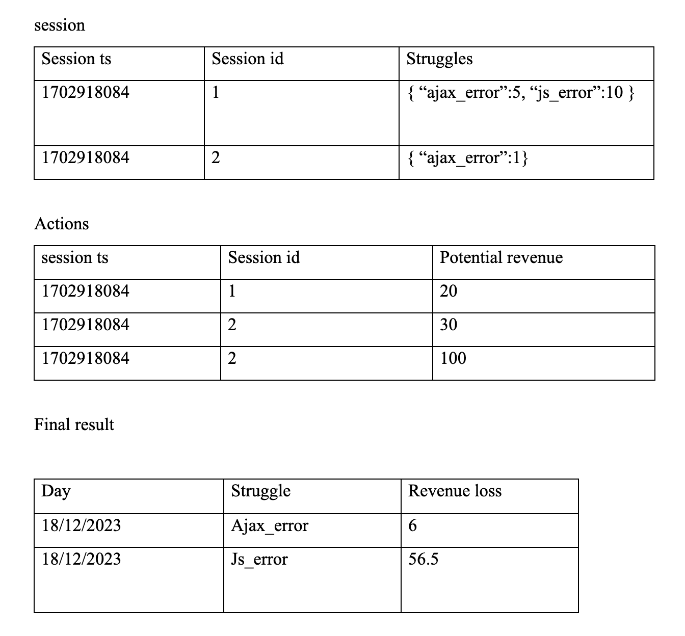

# Spark live coding assignment
Live coding Spark assignment that I did during one of my interviews

## Coding assignment

---
**Session Data** - Holds aggregated information about a full session , a session is a visit to a website!
---
Path:  /data/session_data.parquet
---
**Columns:**
*   **tenant_uuid** – uuid of the customer
*   **session_ts**: timestamp of the start of the given session, in ms
*   **session_uuid**: unique ID for the session in Glassbox
*   **struggle_types**: an array of dictionaries representing various struggles and their aggregated values throughout the session.
*   is_converted
*   struggle_converted

---
**user_action** - Holds information about specific “actions” (predefined list) performed during a session
---
Path:  /data/user_events/*.parquet
---

**Columns:**

*   **tenant_uuid** – uuid of the customer
*   **date**
*   **dom_element** – element on which the action occurred
*   **session_ts** - timestamp of the start of the given session, in ms
*   **session_uuid**: unique ID for the session in Glassbox
*   **potential_revenue**: collected revenue
*   **client_action**: name of the action that triggered a row in this table (‘click’, ‘scroll’,  ‘load’, ‘hover’)
*   **struggle_score**: struggle score for the session up to this action.

**Take few minutes to learn and get acquintance with the data before proceeding further**

---
**Exercise 1**
---
Compute for each and session, and for each tenant

-  	Number of click actions in the session
-  	Number of unique dom_elements in session
-  	Number of clicks that has a potential revenue (more than 0) in the session
-  	Number of page loads in the session

---
**Exercise 2**
---
A revenue is considered lost if the session is not converted.  (is_converted=False)
We would like to compute the **daily average revenue loss by session**,  for each struggle.

Since revenue is saved in the action table, while the struggles as a dictionary in the session table, the computation for struggle revenue loss by session is:

**We will define a struggle potential revenue as** :
---
sum(potential_revenue) * (#struggle_type_occurences / #struggles in session)
---
example:

